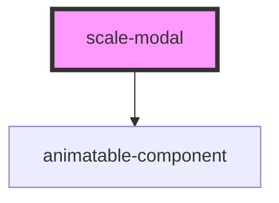

# scale-modal

<!-- Auto Generated Below -->

## Properties

| Property      | Attribute      | Description                    | Type                                     | Default     |
| ------------- | -------------- | ------------------------------ | ---------------------------------------- | ----------- |
| `customClass` | `custom-class` | (optional) Modal class         | `string`                                 | `''`        |
| `opened`      | `opened`       | (required) Modal opened        | `boolean`                                | `false`     |
| `size`        | `size`         | (optional) Modal size          | `string`                                 | `''`        |
| `styles`      | --             | (optional) Injected jss styles | `StyleSheet<string \| number \| symbol>` | `undefined` |
| `variant`     | `variant`      | (optional) Modal variant       | `string`                                 | `''`        |

## Events

| Event        | Description            | Type                      |
| ------------ | ---------------------- | ------------------------- |
| `scaleClose` | (optional) Close event | `CustomEvent<MouseEvent>` |

## Methods

### `close(event?: MouseEvent) => Promise<void>`

Close the modal

#### Returns

Type: `Promise<void>`

### `open() => Promise<void>`

Open the modal

#### Returns

Type: `Promise<void>`

## Dependencies

### Depends on

- animatable-component

### Graph

----------------------------------------------

*Built with [StencilJS](https://stenciljs.com/)*
