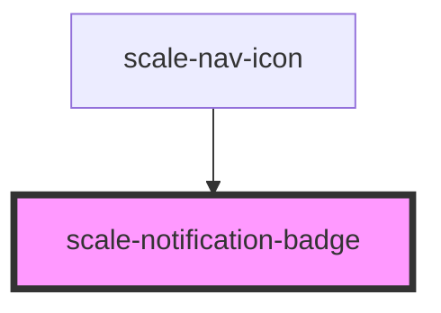

# scale-notification-badge

<!-- Auto Generated Below -->

## Properties

| Property        | Attribute        | Description                                                       | Type                             | Default     |
| --------------- | ---------------- | ----------------------------------------------------------------- | -------------------------------- | ----------- |
| `clickHandler`  | `click-handler`  | (optional) Handle click on the badge and surroundet slot elements | `any`                            | `undefined` |
| `label`         | `label`          | (optional) Text that is displayed in the badge                    | `number`                         | `undefined` |
| `maxCharacters` | `max-characters` | (optional) Maximal number of characters displayed in the badge    | `number`                         | `3`         |
| `type`          | `type`           | (optional) Setting/Slotcontent in which the badge is used         | `"icon" \| "nav-icon" \| "text"` | `'icon'`    |

## Dependencies

### Used by

 - [scale-nav-icon](../telekom/nav-icon)

### Graph

----------------------------------------------

*Built with [StencilJS](https://stenciljs.com/)*
