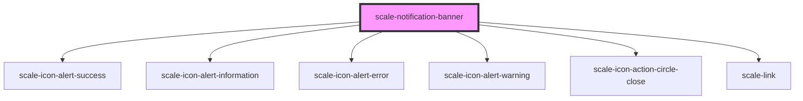

# scale-notification-banner

<!-- Auto Generated Below -->

## Properties

| Property           | Attribute            | Description                       | Type                                                   | Default           |
| ------------------ | -------------------- | --------------------------------- | ------------------------------------------------------ | ----------------- |
| `autoHide`         | `auto-hide`          |                                   | `boolean`                                              | `false`           |
| `autoHideDuration` | `auto-hide-duration` |                                   | `number`                                               | `3000`            |
| `closeButtonLabel` | `close-button-label` | (optional) Label for close button | `string`                                               | `'close'`         |
| `closeButtonTitle` | `close-button-title` | (optional) Title for close button | `string`                                               | `'close'`         |
| `dismissible`      | `dismissible`        |                                   | `boolean`                                              | `false`           |
| `href`             | `href`               |                                   | `string`                                               | `undefined`       |
| `opened`           | `opened`             |                                   | `boolean`                                              | `undefined`       |
| `variant`          | `variant`            |                                   | `"error" \| "informational" \| "success" \| "warning"` | `'informational'` |

## Events

| Event         | Description                                           | Type                |
| ------------- | ----------------------------------------------------- | ------------------- |
| `scale-close` | Fires when the notification banner has been dismissed | `CustomEvent<void>` |

## Methods

### `open() => Promise<void>`

#### Returns

Type: `Promise<void>`

## Shadow Parts

| Part                   | Description |
| ---------------------- | ----------- |
| `"button-dismissable"` |             |
| `"container"`          |             |
| `"heading"`            |             |
| `"text"`               |             |

## Dependencies

### Depends on

- [scale-icon-alert-success](../icons/alert-success)
- [scale-icon-alert-information](../icons/alert-information)
- [scale-icon-alert-error](../icons/alert-error)
- [scale-icon-alert-warning](../icons/alert-warning)
- [scale-icon-action-circle-close](../icons/action-circle-close)
- [scale-link](../link)

### Graph

----------------------------------------------

*Built with [StencilJS](https://stenciljs.com/)*
