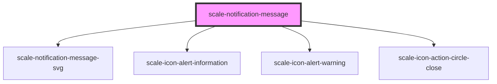

# scale-notification-message

<!-- Auto Generated Below -->

## Properties

| Property      | Attribute     | Description | Type                                                   | Default           |
| ------------- | ------------- | ----------- | ------------------------------------------------------ | ----------------- |
| `dismissible` | `dismissible` |             | `boolean`                                              | `false`           |
| `opened`      | `opened`      |             | `boolean`                                              | `undefined`       |
| `timeout`     | `timeout`     |             | `boolean \| number`                                    | `false`           |
| `variant`     | `variant`     |             | `"error" \| "informational" \| "success" \| "warning"` | `'informational'` |

## Methods

### `open() => Promise<void>`

#### Returns

Type: `Promise<void>`

## Shadow Parts

| Part          | Description |
| ------------- | ----------- |
| `"container"` |             |
| `"heading"`   |             |
| `"text"`      |             |

## Dependencies

### Depends on

- [scale-notification-message-svg](svg)
- [scale-icon-alert-information](../icons/alert-information)
- [scale-icon-alert-warning](../icons/alert-warning)
- [scale-icon-action-circle-close](../icons/action-circle-close)

### Graph

----------------------------------------------

*Built with [StencilJS](https://stenciljs.com/)*
