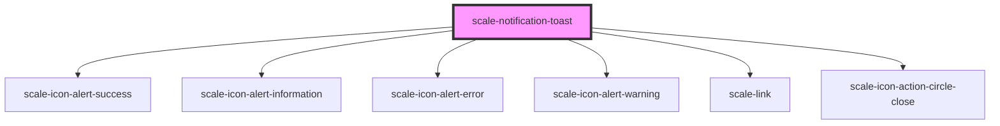

# scale-notification-toast

<!-- Auto Generated Below -->

## Properties

| Property             | Attribute             | Description                                    | Type                                                           | Default           |
| -------------------- | --------------------- | ---------------------------------------------- | -------------------------------------------------------------- | ----------------- |
| `alignment`          | `alignment`           | (optional) Alignment choose for top and bottom | `"bottom-left" \| "bottom-right" \| "top-left" \| "top-right"` | `'top-right'`     |
| `animated`           | `animated`            | (optional) Animated toast                      | `boolean`                                                      | `true`            |
| `autoHide`           | `auto-hide`           | (optional) Toast auto hide                     | `boolean`                                                      | `false`           |
| `autoHideDuration`   | `auto-hide-duration`  | (optional) Toast auto hide duration            | `number`                                                       | `3000`            |
| `closeButtonLabel`   | `close-button-label`  | (optional) Label for close button              | `string`                                                       | `'close'`         |
| `closeButtonTitle`   | `close-button-title`  | (optional) Title for close button              | `string`                                                       | `'close'`         |
| `fadeDuration`       | `fade-duration`       | (optional) Toast fade duration                 | `number`                                                       | `500`             |
| `href`               | `href`                |                                                | `string`                                                       | `undefined`       |
| `opened`             | `opened`              | (optional) Toast opened                        | `boolean`                                                      | `undefined`       |
| `positionHorizontal` | `position-horizontal` | (optional) Toast position right                | `number`                                                       | `12`              |
| `positionVertical`   | `position-vertical`   | (optional) Toast position at the top           | `number`                                                       | `12`              |
| `story`              | `story`               | (do not use) it is a helper prop for storybook | `boolean`                                                      | `undefined`       |
| `styles`             | `styles`              | (optional) Injected CSS styles                 | `string`                                                       | `undefined`       |
| `variant`            | `variant`             | (optional) Toast variant                       | `"error" \| "informational" \| "success" \| "warning"`         | `'informational'` |

## Methods

### `open() => Promise<void>`

Toast method: open()

#### Returns

Type: `Promise<void>`

## Shadow Parts

| Part                   | Description |
| ---------------------- | ----------- |
| `"button-dismissable"` |             |

## Dependencies

### Depends on

- [scale-icon-alert-success](../icons/alert-success)
- [scale-icon-alert-information](../icons/alert-information)
- [scale-icon-alert-error](../icons/alert-error)
- [scale-icon-alert-warning](../icons/alert-warning)
- [scale-link](../link)
- [scale-icon-action-circle-close](../icons/action-circle-close)

### Graph

----------------------------------------------

*Built with [StencilJS](https://stenciljs.com/)*
