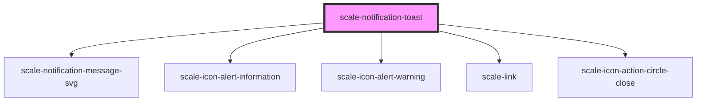

# scale-notification-toast

<!-- Auto Generated Below -->

## Properties

| Property        | Attribute        | Description                          | Type                                                   | Default           |
| --------------- | ---------------- | ------------------------------------ | ------------------------------------------------------ | ----------------- |
| `animated`      | `animated`       | (optional) Animated toast            | `boolean`                                              | `true`            |
| `fadeDuration`  | `fade-duration`  | (optional) Toast fade duration       | `number`                                               | `500`             |
| `opened`        | `opened`         | (optional) Toast opened              | `boolean`                                              | `undefined`       |
| `positionRight` | `position-right` | (optional) Toast position right      | `number`                                               | `12`              |
| `positionTop`   | `position-top`   | (optional) Toast position at the top | `number`                                               | `12`              |
| `size`          | `size`           | (optional) Toast size                | `string`                                               | `''`              |
| `styles`        | `styles`         | (optional) Injected CSS styles       | `string`                                               | `undefined`       |
| `variant`       | `variant`        | (optional) Toast variant             | `"error" \| "informational" \| "success" \| "warning"` | `'informational'` |

## Methods

### `open() => Promise<void>`

Toast method: open()

#### Returns

Type: `Promise<void>`

## Dependencies

### Depends on

- [scale-notification-message-svg](../notification-message)
- [scale-icon-alert-information](../icons/alert-information)
- [scale-icon-alert-warning](../icons/alert-warning)
- [scale-link](../link)
- [scale-icon-action-circle-close](../icons/action-circle-close)

### Graph

----------------------------------------------

*Built with [StencilJS](https://stenciljs.com/)*
