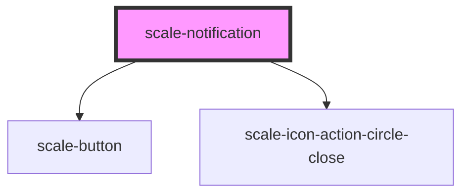

# scale-notification

<!-- Auto Generated Below -->

## Properties

| Property      | Attribute     | Description                             | Type                                                    | Default           |
| ------------- | ------------- | --------------------------------------- | ------------------------------------------------------- | ----------------- |
| `dismissible` | `dismissible` | (optional) Dismissible via close button | `boolean`                                               | `false`           |
| `heading`     | `heading`     | Heading                                 | `string`                                                | `undefined`       |
| `opened`      | `opened`      | (optional) Visible                      | `boolean`                                               | `undefined`       |
| `styles`      | `styles`      | (optional) Injected styles              | `string`                                                | `undefined`       |
| `type`        | `type`        | (optional) Type                         | `"banner" \| "inline" \| "toast"`                       | `'inline'`        |
| `variant`     | `variant`     | (optional) Variant                      | `"danger" \| "informational" \| "success" \| "warning"` | `'informational'` |

## Shadow Parts

| Part             | Description |
| ---------------- | ----------- |
| `"base"`         |             |
| `"body"`         |             |
| `"close-button"` |             |
| `"heading"`      |             |
| `"icon"`         |             |
| `"text"`         |             |

## Dependencies

### Depends on

- [scale-button](../button)
- [scale-icon-action-circle-close](../icons/action-circle-close)

### Graph

----------------------------------------------

*Built with [StencilJS](https://stenciljs.com/)*
