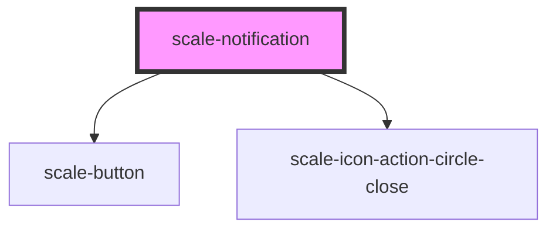

# scale-notification

<!-- Auto Generated Below -->

## Properties

| Property           | Attribute            | Description                                               | Type                                                    | Default           |
| ------------------ | -------------------- | --------------------------------------------------------- | ------------------------------------------------------- | ----------------- |
| `closeButtonLabel` | `close-button-label` | (optional) Label for close button                         | `string`                                                | `'Close Pop-up'`  |
| `closeButtonTitle` | `close-button-title` | (optional) `title` for close button                       | `string`                                                | `'Close'`         |
| `delay`            | `delay`              | (optional) Time in milliseconds until it closes by itself | `number`                                                | `undefined`       |
| `dismissible`      | `dismissible`        | (optional) Show the close button                          | `boolean`                                               | `false`           |
| `heading`          | `heading`            | Heading                                                   | `string`                                                | `undefined`       |
| `innerAriaLive`    | `inner-aria-live`    | (optional) `aria-live` of element                         | `string`                                                | `'assertive'`     |
| `opened`           | `opened`             | (optional) Visible                                        | `boolean`                                               | `undefined`       |
| `styles`           | `styles`             | (optional) Injected styles                                | `string`                                                | `undefined`       |
| `type`             | `type`               | (optional) Type                                           | `"banner" \| "inline" \| "toast"`                       | `'inline'`        |
| `variant`          | `variant`            | (optional) Variant                                        | `"danger" \| "informational" \| "success" \| "warning"` | `'informational'` |

## Events

| Event         | Description | Type                |
| ------------- | ----------- | ------------------- |
| `scale-close` |             | `CustomEvent<void>` |
| `scale-open`  |             | `CustomEvent<void>` |

## Shadow Parts

| Part             | Description |
| ---------------- | ----------- |
| `"body"`         |             |
| `"close-button"` |             |
| `"heading"`      |             |
| `"icon"`         |             |
| `"text"`         |             |

## Dependencies

### Depends on

- [scale-button](../button)
- [scale-icon-action-circle-close](../icons/action-circle-close)

### Graph

----------------------------------------------

*Built with [StencilJS](https://stenciljs.com/)*
