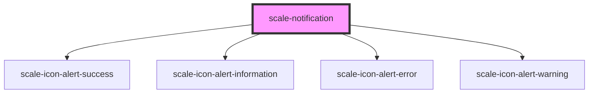

# scale-notification

<!-- Auto Generated Below -->

## Properties

| Property  | Attribute | Description                | Type                                                   | Default           |
| --------- | --------- | -------------------------- | ------------------------------------------------------ | ----------------- |
| `heading` | `heading` | Heading                    | `string`                                               | `undefined`       |
| `opened`  | `opened`  | (optional) Toast opened    | `boolean`                                              | `undefined`       |
| `styles`  | `styles`  | (optional) Injected styles | `string`                                               | `undefined`       |
| `variant` | `variant` | (optional) Variant         | `"error" \| "informational" \| "success" \| "warning"` | `'informational'` |

## Dependencies

### Depends on

- [scale-icon-alert-success](../icons/alert-success)
- [scale-icon-alert-information](../icons/alert-information)
- [scale-icon-alert-error](../icons/alert-error)
- [scale-icon-alert-warning](../icons/alert-warning)

### Graph

----------------------------------------------

*Built with [StencilJS](https://stenciljs.com/)*
