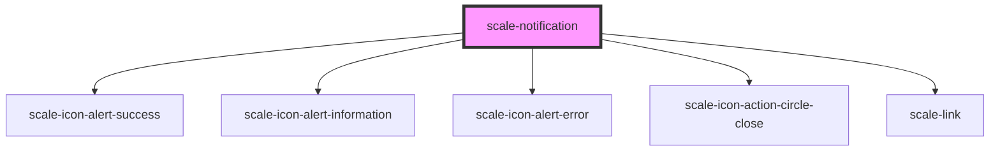

# scale-notification

<!-- Auto Generated Below -->

## Properties

| Property                  | Attribute                   | Description                                    | Type                                                           | Default           |
| ------------------------- | --------------------------- | ---------------------------------------------- | -------------------------------------------------------------- | ----------------- |
| `autoHide`                | `auto-hide`                 |                                                | `boolean`                                                      | `false`           |
| `autoHideDuration`        | `auto-hide-duration`        |                                                | `number`                                                       | `3000`            |
| `dismissible`             | `dismissible`               |                                                | `boolean`                                                      | `false`           |
| `href`                    | `href`                      |                                                | `string`                                                       | `undefined`       |
| `opened`                  | `opened`                    |                                                | `boolean`                                                      | `undefined`       |
| `styles`                  | `styles`                    | (optional) Injected CSS styles                 | `string`                                                       | `undefined`       |
| `toastAlignment`          | `toast-alignment`           | (optional) Alignment of toast                  | `"bottom-left" \| "bottom-right" \| "top-left" \| "top-right"` | `'top-right'`     |
| `toastAnimated`           | `toast-animated`            | (optional) Animated toast                      | `boolean`                                                      | `true`            |
| `toastFadeDuration`       | `toast-fade-duration`       | (optional) Toast fade duration                 | `number`                                                       | `500`             |
| `toastNumber`             | `toast-number`              | Number of toast                                | `number`                                                       | `undefined`       |
| `toastPositionHorizontal` | `toast-position-horizontal` | (optional) Toast position right                | `number`                                                       | `12`              |
| `toastPositionVertical`   | `toast-position-vertical`   | (optional) Toast position at the top           | `number`                                                       | `12`              |
| `toastStory`              | `toast-story`               | (do not use) it is a helper prop for storybook | `boolean`                                                      | `undefined`       |
| `type`                    | `type`                      |                                                | `"banner" \| "inline" \| "toast"`                              | `'inline'`        |
| `variant`                 | `variant`                   |                                                | `"error" \| "informational" \| "success" \| "warning"`         | `'informational'` |

## Methods

### `open() => Promise<void>`

#### Returns

Type: `Promise<void>`

## Shadow Parts

| Part                   | Description |
| ---------------------- | ----------- |
| `"button-dismissable"` |             |
| `"container"`          |             |
| `"heading"`            |             |
| `"link"`               |             |
| `"text"`               |             |

## Dependencies

### Depends on

- [scale-icon-alert-success](../icons/alert-success)
- [scale-icon-alert-information](../icons/alert-information)
- [scale-icon-alert-error](../icons/alert-error)
- [scale-icon-action-circle-close](../icons/action-circle-close)
- [scale-link](../link)

### Graph

----------------------------------------------

*Built with [StencilJS](https://stenciljs.com/)*
