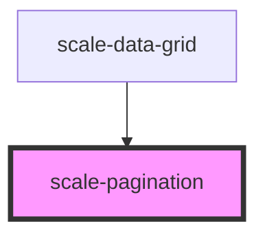

# scale-pagination

<!-- Auto Generated Below -->

## Properties

| Property         | Attribute          | Description                                                              | Type      | Default                 |
| ---------------- | ------------------ | ------------------------------------------------------------------------ | --------- | ----------------------- |
| `hideBorders`    | `hide-borders`     | (optional) Set to true to hide top and bottom borders                    | `boolean` | `false`                 |
| `langGoFirst`    | `lang-go-first`    | (optional) translation to 'Go to first page'                             | `string`  | `'Go to first page'`    |
| `langGoLast`     | `lang-go-last`     | (optional) translation to 'Go to last page'                              | `string`  | `'Go to last page'`     |
| `langGoNextt`    | `lang-go-nextt`    | (optional) translation to 'Go to next page'                              | `string`  | `'Go to next page'`     |
| `langGoPrevious` | `lang-go-previous` | (optional) translation to 'Go to previous page'                          | `string`  | `'Go to previous page'` |
| `pageSize`       | `page-size`        | (optional) Set number of rows/elements to show per page                  | `number`  | `10`                    |
| `small`          | `small`            | (optional) small                                                         | `boolean` | `true`                  |
| `startElement`   | `start-element`    | (optional) Index of first element to display                             | `number`  | `0`                     |
| `styles`         | `styles`           | (optional) Injected styles                                               | `string`  | `undefined`             |
| `totalElements`  | `total-elements`   | (optional) Total number of rows/elements used to calculate page displays | `number`  | `1`                     |

## Events

| Event             | Description                                                                | Type                                                            |
| ----------------- | -------------------------------------------------------------------------- | --------------------------------------------------------------- |
| `scalePagination` | Event triggered every time the data is edited, changing original rows data | `CustomEvent<{ startElement?: number; currentPage?: number; }>` |

## Shadow Parts

| Part                | Description |
| ------------------- | ----------- |
| `"first-prompt"`    |             |
| `"info"`            |             |
| `"info-responsive"` |             |
| `"last-prompt"`     |             |
| `"next-prompt"`     |             |
| `"prev-prompt"`     |             |

## Dependencies

### Used by

 - [scale-data-grid](../data-grid)

### Graph

----------------------------------------------

*Built with [StencilJS](https://stenciljs.com/)*
