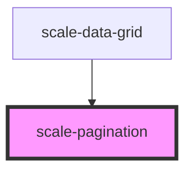

# scale-pagination

<!-- Auto Generated Below -->

## Properties

| Property        | Attribute        | Description                                                              | Type      | Default |
| --------------- | ---------------- | ------------------------------------------------------------------------ | --------- | ------- |
| `hideBorders`   | `hide-borders`   | (optional) Set to true to hide top and bottom borders                    | `boolean` | `false` |
| `pageSize`      | `page-size`      | (optional) Set number of rows/elements to show per page                  | `number`  | `10`    |
| `startElement`  | `start-element`  | (optional) Index of first element to display                             | `number`  | `0`     |
| `totalElements` | `total-elements` | (optional) Total number of rows/elements used to calculate page displays | `number`  | `1`     |

## Events

| Event             | Description                                                                | Type                                                            |
| ----------------- | -------------------------------------------------------------------------- | --------------------------------------------------------------- |
| `scalePagination` | Event triggered every time the data is edited, changing original rows data | `CustomEvent<{ startElement?: number; currentPage?: number; }>` |

## Shadow Parts

| Part             | Description |
| ---------------- | ----------- |
| `"first-prompt"` |             |
| `"info"`         |             |
| `"last-prompt"`  |             |
| `"next-prompt"`  |             |
| `"prev-prompt"`  |             |

## Dependencies

### Used by

 - [scale-data-grid](../data-grid)

### Graph

----------------------------------------------

*Built with [StencilJS](https://stenciljs.com/)*
