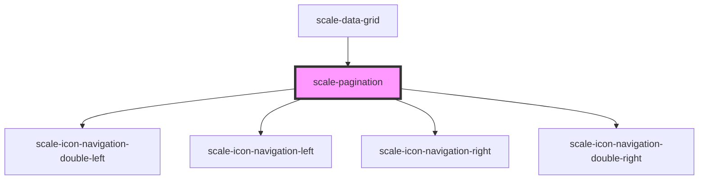

# scale-pagination

<!-- Auto Generated Below -->

## Properties

| Property                | Attribute                  | Description                                                                           | Type                 | Default                 |
| ----------------------- | -------------------------- | ------------------------------------------------------------------------------------- | -------------------- | ----------------------- |
| `ariaLabelFirstPage`    | `aria-label-first-page`    | (optional) translation to 'Go to first page'                                          | `string`             | `'Go to first page'`    |
| `ariaLabelLastPage`     | `aria-label-last-page`     | (optional) translation to 'Go to last page'                                           | `string`             | `'Go to last page'`     |
| `ariaLabelNextPage`     | `aria-label-next-page`     | (optional) translation to 'Go to next page'                                           | `string`             | `'Go to next page'`     |
| `ariaLabelPreviousPage` | `aria-label-previous-page` | (optional) translation to 'Go to previous page'                                       | `string`             | `'Go to previous page'` |
| `hideBorder`            | `hide-border`              | (optional) Set to true to hide top and bottom borders                                 | `boolean`            | `false`                 |
| `hideBorders`           | `hide-borders`             | (optional) Deprecated; hideBorder should replace hideBorders                          | `boolean`            | `false`                 |
| `pageSize`              | `page-size`                | (optional) Set number of rows/elements to show per page                               | `number`             | `10`                    |
| `size`                  | `size`                     | **[DEPRECATED]** - size should replace small   | `"large" \| "small"` | `undefined`             |
| `small`                 | `small`                    | **[DEPRECATED]** - size should replace small   | `boolean`            | `false`                 |
| `startElement`          | `start-element`            | (optional) Index of first element to display                                          | `number`             | `0`                     |
| `styles`                | `styles`                   | (optional) Injected styles                                                            | `string`             | `undefined`             |
| `totalElements`         | `total-elements`           | (optional) Total number of rows/elements used to calculate page displays              | `number`             | `1`                     |

## Events

| Event              | Description                                                                                        | Type                                                                                                 |
| ------------------ | -------------------------------------------------------------------------------------------------- | ---------------------------------------------------------------------------------------------------- |
| `scale-pagination` | Event triggered every time the data is edited, changing original rows data                         | `CustomEvent<{ startElement?: number; currentPage?: number; direction: PaginationEventDirection; }>` |
| `scalePagination`  | **[DEPRECATED]** in v3 in favor of kebab-case event names   | `CustomEvent<{ startElement?: number; currentPage?: number; direction: PaginationEventDirection; }>` |

## Shadow Parts

| Part                | Description |
| ------------------- | ----------- |
| `"first-prompt"`    |             |
| `"info"`            |             |
| `"info-responsive"` |             |
| `"last-prompt"`     |             |
| `"next-prompt"`     |             |
| `"prev-prompt"`     |             |

## Dependencies

### Used by

 - [scale-data-grid](../data-grid)

### Depends on

- [scale-icon-navigation-double-left](../icons/navigation-double-left)
- [scale-icon-navigation-left](../icons/navigation-left)
- [scale-icon-navigation-right](../icons/navigation-right)
- [scale-icon-navigation-double-right](../icons/navigation-double-right)

### Graph

----------------------------------------------

*Built with [StencilJS](https://stenciljs.com/)*
