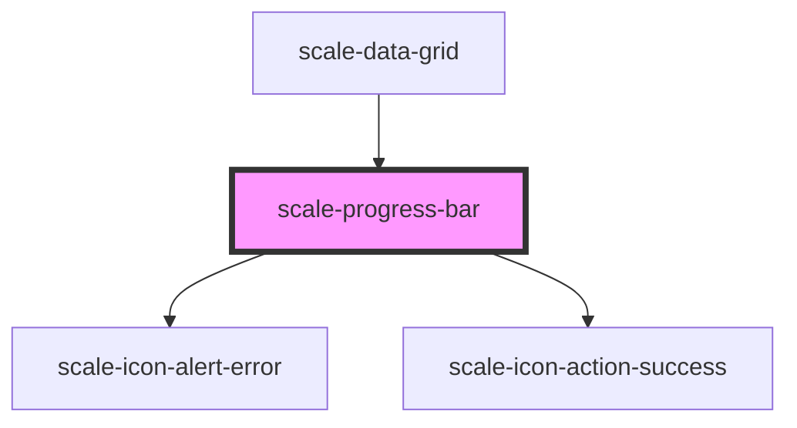

# scale-progress-bar

<!-- Auto Generated Below -->

## Properties

| Property            | Attribute            | Description                                                                                     | Type      | Default     |
| ------------------- | -------------------- | ----------------------------------------------------------------------------------------------- | --------- | ----------- |
| `busy`              | `busy`               | (optional) Progress bar busy switch                                                             | `boolean` | `false`     |
| `customColor`       | `custom-color`       | **[DEPRECATED]** - (optional) Progress bar customColor   | `string`  | `undefined` |
| `disabled`          | `disabled`           | (optional) Progress bar disabled                                                                | `boolean` | `undefined` |
| `hasError`          | `has-error`          | (optional) Progress bar error                                                                   | `boolean` | `undefined` |
| `icon`              | `icon`               | (optional) Progress bar icon indicator                                                          | `string`  | `undefined` |
| `label`             | `label`              | (optional) Progress bar label                                                                   | `string`  | `undefined` |
| `mute`              | `mute`               | (optional) disables aria-live                                                                   | `boolean` | `undefined` |
| `percentage`        | `percentage`         | (required) Progress bar percentage                                                              | `number`  | `0`         |
| `percentageStart`   | `percentage-start`   | (optional) Progress bar percentage to start the animation from (default: 0)                     | `number`  | `0`         |
| `progressBarId`     | `progress-bar-id`    | (optional) Progress bar id                                                                      | `string`  | `undefined` |
| `showStatus`        | `show-status`        | (optional) Progress bar percentage text                                                         | `boolean` | `true`      |
| `statusDescription` | `status-description` | (optional) Progress bar status description text                                                 | `string`  | `undefined` |
| `styles`            | `styles`             | (optional) Injected CSS styles                                                                  | `string`  | `undefined` |

## Shadow Parts

| Part                   | Description |
| ---------------------- | ----------- |
| `"inner"`              |             |
| `"label"`              |             |
| `"outer"`              |             |
| `"status"`             |             |
| `"status-description"` |             |
| `"wrapper"`            |             |

## Dependencies

### Used by

 - [scale-data-grid](../data-grid)

### Depends on

- [scale-icon-alert-error](../icons/alert-error)
- [scale-icon-action-success](../icons/action-success)

### Graph

----------------------------------------------

*Built with [StencilJS](https://stenciljs.com/)*
