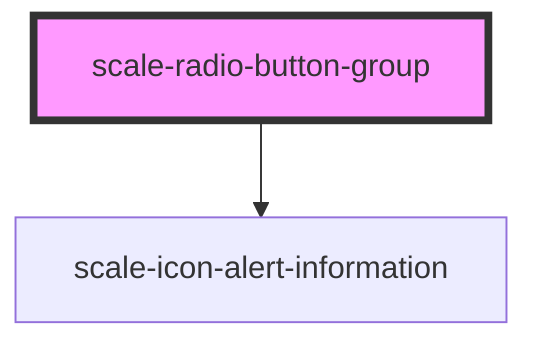

# scale-radio-button-group

<!-- Auto Generated Below -->

## Properties

| Property     | Attribute     | Description                  | Type     | Default |
| ------------ | ------------- | ---------------------------- | -------- | ------- |
| `helperText` | `helper-text` | (optional) Input helper text | `string` | `''`    |
| `label`      | `label`       | (optional) Input label       | `string` | `''`    |
| `status`     | `status`      | (optional) Input status      | `string` | `''`    |

## Dependencies

### Depends on

- [scale-icon-alert-information](../icons/alert-information)

### Graph

----------------------------------------------

*Built with [StencilJS](https://stenciljs.com/)*
