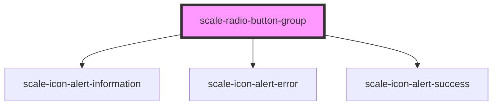

# scale-radio-button-group

<!-- Auto Generated Below -->

## Properties

| Property     | Attribute     | Description                                                                               | Type      | Default |
| ------------ | ------------- | ----------------------------------------------------------------------------------------- | --------- | ------- |
| `helperText` | `helper-text` | (optional) Input helper text                                                              | `string`  | `''`    |
| `info`       | `info`        | (optional) Input status                                                                   | `boolean` | `true`  |
| `invalid`    | `invalid`     | (optional) Input status                                                                   | `boolean` | `false` |
| `label`      | `label`       | (optional) Input label                                                                    | `string`  | `''`    |
| `status`     | `status`      | **[DEPRECATED]** - invalid should replace status   | `string`  | `''`    |
| `success`    | `success`     | (optional) Input status                                                                   | `boolean` | `false` |
| `warning`    | `warning`     | (optional) Input status                                                                   | `boolean` | `false` |

## Dependencies

### Depends on

- [scale-icon-alert-information](../icons/alert-information)
- [scale-icon-alert-error](../icons/alert-error)
- [scale-icon-alert-success](../icons/alert-success)

### Graph

----------------------------------------------

*Built with [StencilJS](https://stenciljs.com/)*
