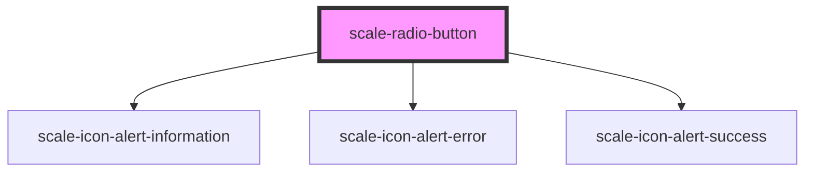

# scale-radio-button

<!-- Auto Generated Below -->

## Properties

| Property     | Attribute     | Description                                                                               | Type               | Default     |
| ------------ | ------------- | ----------------------------------------------------------------------------------------- | ------------------ | ----------- |
| `checked`    | `checked`     | (optional) Input checked                                                                  | `boolean`          | `false`     |
| `disabled`   | `disabled`    | (optional) Input disabled                                                                 | `boolean`          | `undefined` |
| `helperText` | `helper-text` | (optional) Input helper text                                                              | `string`           | `''`        |
| `info`       | `info`        | (optional) Input status                                                                   | `boolean`          | `true`      |
| `inputId`    | `input-id`    | (optional) Input checkbox id                                                              | `string`           | `undefined` |
| `invalid`    | `invalid`     | (optional) Input status                                                                   | `boolean`          | `false`     |
| `label`      | `label`       | (optional) Input label                                                                    | `string`           | `''`        |
| `name`       | `name`        | (optional) Input name                                                                     | `string`           | `''`        |
| `status`     | `status`      | **[DEPRECATED]** - invalid should replace status   | `string`           | `''`        |
| `styles`     | `styles`      | (optional) Injected CSS styles                                                            | `string`           | `undefined` |
| `success`    | `success`     | (optional) Input status                                                                   | `boolean`          | `false`     |
| `value`      | `value`       | (optional) Input value                                                                    | `number \| string` | `''`        |
| `warning`    | `warning`     | (optional) Input status                                                                   | `boolean`          | `false`     |

## Events

| Event          | Description                                                                                        | Type                                  |
| -------------- | -------------------------------------------------------------------------------------------------- | ------------------------------------- |
| `scale-change` |                                                                                                    | `CustomEvent<InputChangeEventDetail>` |
| `scaleChange`  | **[DEPRECATED]** in v3 in favor of kebab-case event names   | `CustomEvent<InputChangeEventDetail>` |

## Dependencies

### Depends on

- [scale-icon-alert-information](../icons/alert-information)
- [scale-icon-alert-error](../icons/alert-error)
- [scale-icon-alert-success](../icons/alert-success)

### Graph

----------------------------------------------

*Built with [StencilJS](https://stenciljs.com/)*
