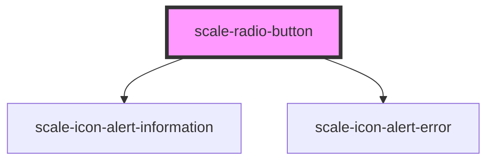

# scale-radio-button

<!-- Auto Generated Below -->

## Properties

| Property        | Attribute         | Description                                                                                                      | Type               | Default     |
| --------------- | ----------------- | ---------------------------------------------------------------------------------------------------------------- | ------------------ | ----------- |
| `ariaDetailsId` | `aria-details-id` | (optional) id or space separated list of ids of elements that provide or link to additional related information. | `string`           | `undefined` |
| `checked`       | `checked`         | (optional) Input checked                                                                                         | `boolean`          | `false`     |
| `dataQa`        | `data-qa`         | (optional) data-qa attribute for e2e testing                                                                     | `string`           | `undefined` |
| `disabled`      | `disabled`        | (optional) Input disabled                                                                                        | `boolean`          | `undefined` |
| `helperText`    | `helper-text`     | (optional) Input helper text                                                                                     | `string`           | `''`        |
| `inputId`       | `input-id`        | (optional) Input checkbox id                                                                                     | `string`           | `undefined` |
| `invalid`       | `invalid`         | (optional) Input status                                                                                          | `boolean`          | `false`     |
| `label`         | `label`           | (optional) Input label                                                                                           | `string`           | `''`        |
| `name`          | `name`            | (optional) Input name                                                                                            | `string`           | `''`        |
| `status`        | `status`          | **[DEPRECATED]** - invalid should replace status                          | `string`           | `''`        |
| `styles`        | `styles`          | (optional) Injected CSS styles                                                                                   | `string`           | `undefined` |
| `value`         | `value`           | (optional) Input value                                                                                           | `number \| string` | `''`        |

## Events

| Event          | Description | Type                                  |
| -------------- | ----------- | ------------------------------------- |
| `scale-change` |             | `CustomEvent<InputChangeEventDetail>` |

## Dependencies

### Depends on

- [scale-icon-alert-information](../icons/alert-information)
- [scale-icon-alert-error](../icons/alert-error)

### Graph

----------------------------------------------

*Built with [StencilJS](https://stenciljs.com/)*
