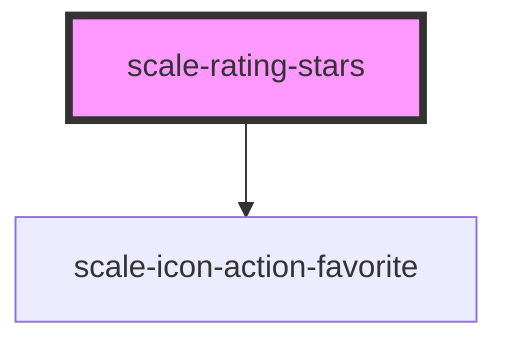

# scale-rating-stars

<!-- Auto Generated Below -->

## Properties

| Property               | Attribute                | Description                                                                                                                                                           | Type                 | Default                       |
| ---------------------- | ------------------------ | --------------------------------------------------------------------------------------------------------------------------------------------------------------------- | -------------------- | ----------------------------- |
| `ariaLabelTranslation` | `aria-label-translation` | a11y text for getting meaningful value. `$rating` and `$max` (deprecated `$maxRating`) are template variables and will be replaces by their corresponding properties. | `string`             | `'$rating out of $max stars'` |
| `disabled`             | `disabled`               | disables input                                                                                                                                                        | `boolean`            | `false`                       |
| `hideLabel`            | `hide-label`             | (optional) info text                                                                                                                                                  | `boolean`            | `false`                       |
| `infoText`             | `info-text`              | (optional) info text                                                                                                                                                  | `string`             | `undefined`                   |
| `label`                | `label`                  | (optional) rating label                                                                                                                                               | `string`             | `'Rating'`                    |
| `max`                  | `max`                    | The upper limit of the rating                                                                                                                                         | `number`             | `5`                           |
| `maxRating`            | `max-rating`             | **[DEPRECATED]** ; max should be used instead of maxRating                                                                     | `number`             | `5`                           |
| `minRating`            | `min-rating`             | **[DEPRECATED]** ; The lower limit of the rating                                                                               | `number`             | `0`                           |
| `rating`               | `rating`                 | Represents the current value of the rating                                                                                                                            | `number`             | `0`                           |
| `readonly`             | `readonly`               | makes the rating non-interactive (but still accessible)                                                                                                               | `boolean`            | `false`                       |
| `size`                 | `size`                   | size of the stars                                                                                                                                                     | `"large" \| "small"` | `'large'`                     |
| `starSize`             | `star-size`              | **[DEPRECATED]** ; size should be used instead of starSize                                                                     | `"large" \| "small"` | `'large'`                     |

## Events

| Event          | Description                         | Type               |
| -------------- | ----------------------------------- | ------------------ |
| `scale-change` | Emitted when the rating has changed | `CustomEvent<any>` |

## Shadow Parts

| Part                 | Description |
| -------------------- | ----------- |
| `"container"`        |             |
| `"content"`          |             |
| `"infotext"`         |             |
| `"label"`            |             |
| `"placeholder-star"` |             |
| `"range-slider"`     |             |
| `"selected-star"`    |             |
| `"star"`             |             |
| `"wrapper"`          |             |

## Dependencies

### Depends on

- [scale-icon-action-favorite](../icons/action-favorite)

### Graph

----------------------------------------------

*Built with [StencilJS](https://stenciljs.com/)*
