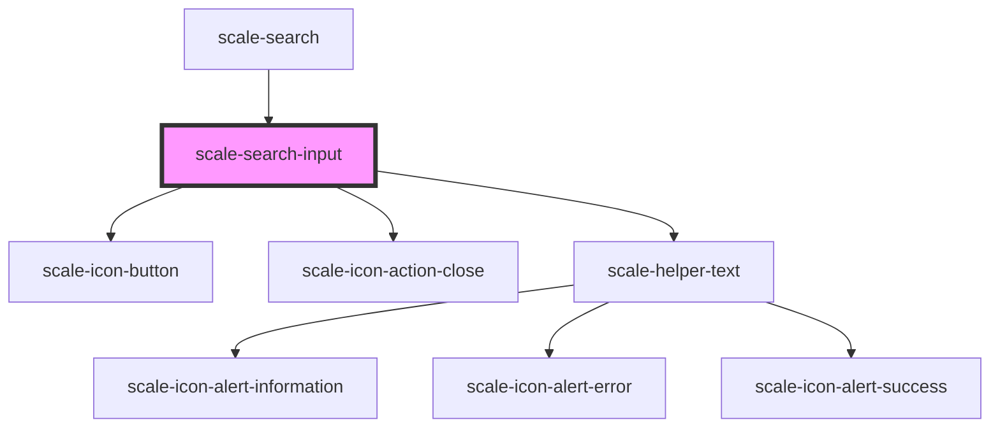

# scale-search

<!-- Auto Generated Below -->

## Properties

| Property                 | Attribute                 | Description                                                                                                      | Type                                                    | Default           |
| ------------------------ | ------------------------- | ---------------------------------------------------------------------------------------------------------------- | ------------------------------------------------------- | ----------------- |
| `ariaDetailedId`         | `aria-detailed-id`        | (optional) id or space separated list of ids of elements that provide or link to additional related information. | `string`                                                | `undefined`       |
| `disabled`               | `disabled`                | (optional) Input disabled                                                                                        | `boolean`                                               | `undefined`       |
| `experimentalControlled` | `experimental-controlled` | (optional)) Makes type `input` behave as a controlled component in React                                         | `boolean`                                               | `false`           |
| `helperText`             | `helper-text`             | (optional) Input helper text                                                                                     | `string`                                                | `''`              |
| `innerAriaExpanded`      | `inner-aria-expanded`     |                                                                                                                  | `string`                                                | `undefined`       |
| `inputAutofocus`         | `input-autofocus`         | (optional) the input should automatically get focus when the page loads.                                         | `boolean`                                               | `undefined`       |
| `inputId`                | `input-id`                |                                                                                                                  | `string`                                                | `undefined`       |
| `invalid`                | `invalid`                 | (optional) Input status                                                                                          | `boolean`                                               | `false`           |
| `label`                  | `label`                   | (optional) Input label                                                                                           | `string`                                                | `'Search'`        |
| `maxLength`              | `max-length`              | (optional) Input text string max length                                                                          | `number`                                                | `undefined`       |
| `minLength`              | `min-length`              | (optional) Input text string min length                                                                          | `number`                                                | `undefined`       |
| `name`                   | `name`                    | (optional) Input name                                                                                            | `string`                                                | `'search'`        |
| `placeholder`            | `placeholder`             | (optional) Input placeHolder                                                                                     | `string`                                                | `'Search'`        |
| `required`               | `required`                | (optional) Input required                                                                                        | `boolean`                                               | `undefined`       |
| `value`                  | `value`                   | (optional) Input value                                                                                           | `string`                                                | `''`              |
| `variant`                | `variant`                 | (optional) Variant                                                                                               | `"danger" \| "informational" \| "success" \| "warning"` | `'informational'` |

## Events

| Event                          | Description                         | Type                         |
| ------------------------------ | ----------------------------------- | ---------------------------- |
| `scale-blur`                   | Emitted when the input loses focus. | `CustomEvent<void>`          |
| `scale-focus`                  | Emitted when the input has focus.   | `CustomEvent<void>`          |
| `scale-interactive-icon-click` | Emitted on interactive icon click   | `CustomEvent<KeyboardEvent>` |
| `scale-keydown`                | Emitted on keydown.                 | `CustomEvent<KeyboardEvent>` |

## Shadow Parts

| Part                  | Description |
| --------------------- | ----------- |
| `"clear-icon"`        |             |
| `"clear-icon-button"` |             |
| `"interactive-icon"`  |             |
| `"label"`             |             |

## Dependencies

### Used by

 - [scale-search](../search)

### Depends on

- [scale-icon-button](../icon-button)
- [scale-icon-action-close](../icons/action-close)
- [scale-helper-text](../helper-text)

### Graph

----------------------------------------------

*Built with [StencilJS](https://stenciljs.com/)*
