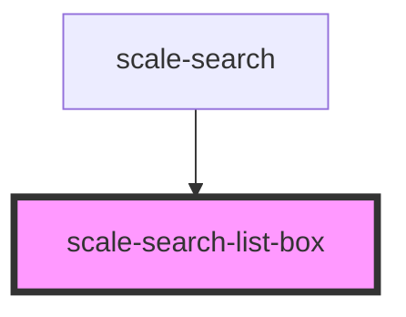

# scale-search-list-box

<!-- Auto Generated Below -->

## Properties

| Property          | Attribute             | Description | Type      | Default      |
| ----------------- | --------------------- | ----------- | --------- | ------------ |
| `comboboxId`      | `combobox-id`         |             | `string`  | `'combobox'` |
| `open`            | `open`                |             | `boolean` | `undefined`  |
| `refListBoxEl`    | `ref-list-box-el`     |             | `any`     | `undefined`  |
| `refListBoxPadEl` | `ref-list-box-pad-el` |             | `any`     | `undefined`  |

## Shadow Parts

| Part                         | Description |
| ---------------------------- | ----------- |
| `"listbox"`                  |             |
| `"listbox-pad"`              |             |
| `"listbox-scroll-container"` |             |

## Dependencies

### Used by

 - [scale-search](../search)

### Graph

----------------------------------------------

*Built with [StencilJS](https://stenciljs.com/)*
