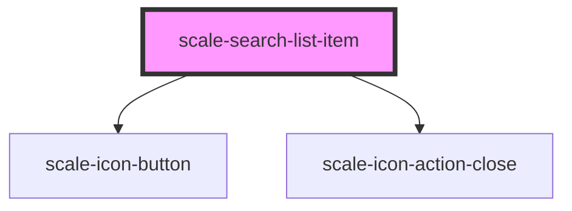

# scale-search-list-item

<!-- Auto Generated Below -->

## Properties

| Property      | Attribute     | Description                                           | Type                  | Default   |
| ------------- | ------------- | ----------------------------------------------------- | --------------------- | --------- |
| `dismissible` | `dismissible` | (optional) is close button to be shown                | `boolean`             | `true`    |
| `variant`     | `variant`     | (optional) The buttons to be shown on Hover or always | `"always" \| "hover"` | `'hover'` |

## Shadow Parts

| Part                  | Description |
| --------------------- | ----------- |
| `"base"`              |             |
| `"clear-icon"`        |             |
| `"clear-icon-button"` |             |
| `"label"`             |             |
| `"prefix"`            |             |
| `"suffix"`            |             |
| `"supporting-text"`   |             |
| `"text"`              |             |

## Dependencies

### Depends on

- [scale-icon-button](../icon-button)
- [scale-icon-action-close](../icons/action-close)

### Graph

----------------------------------------------

*Built with [StencilJS](https://stenciljs.com/)*
