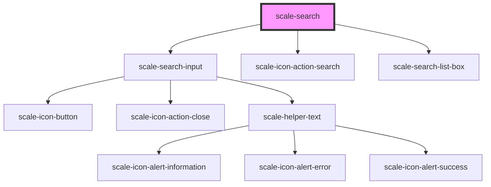

# scale-search

<!-- Auto Generated Below -->

## Properties

| Property     | Attribute     | Description | Type                                                    | Default           |
| ------------ | ------------- | ----------- | ------------------------------------------------------- | ----------------- |
| `comboboxId` | `combobox-id` |             | `string`                                                | `'combobox'`      |
| `disabled`   | `disabled`    |             | `boolean`                                               | `undefined`       |
| `helperText` | `helper-text` |             | `string`                                                | `''`              |
| `label`      | `label`       |             | `string`                                                | `undefined`       |
| `name`       | `name`        |             | `string`                                                | `undefined`       |
| `value`      | `value`       |             | `any`                                                   | `undefined`       |
| `variant`    | `variant`     |             | `"danger" \| "informational" \| "success" \| "warning"` | `'informational'` |

## Events

| Event          | Description | Type                |
| -------------- | ----------- | ------------------- |
| `scale-change` |             | `CustomEvent<void>` |
| `scale-focus`  |             | `CustomEvent<void>` |

## Shadow Parts

| Part                   | Description |
| ---------------------- | ----------- |
| `"combobox-container"` |             |

## Dependencies

### Depends on

- [scale-search-input](../search-input)
- [scale-icon-action-search](../icons/action-search)
- [scale-search-list-box](../search-list-box)

### Graph

----------------------------------------------

*Built with [StencilJS](https://stenciljs.com/)*
