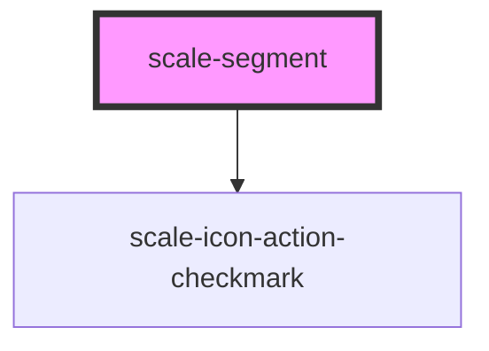

# scale-segmented-button

<!-- Auto Generated Below -->

## Properties

| Property                     | Attribute                      | Description                                                                                                                                            | Type                               | Default     |
| ---------------------------- | ------------------------------ | ------------------------------------------------------------------------------------------------------------------------------------------------------ | ---------------------------------- | ----------- |
| `adjacentSiblings`           | `adjacent-siblings`            |                                                                                                                                                        | `"left" \| "leftright" \| "right"` | `undefined` |
| `ariaDescriptionTranslation` | `aria-description-translation` | a11y text for getting meaningful value. `$buttonNumber` and `$selected` are template variables and will be replaces by their corresponding properties. | `string`                           | `''`        |
| `disabled`                   | `disabled`                     | (optional) If `true`, the button is disabled                                                                                                           | `boolean`                          | `false`     |
| `iconAriaLabel`              | `icon-aria-label`              | (optional) Icon aria-label for icon only                                                                                                               | `string`                           | `undefined` |
| `iconOnly`                   | `icon-only`                    | (optional) icon only segment                                                                                                                           | `boolean`                          | `false`     |
| `iconText`                   | `icon-text`                    | (optional) segment with icon and text                                                                                                                  | `boolean`                          | `false`     |
| `multiSelect`                | `multi-select`                 | (optional) multi select segment                                                                                                                        | `boolean`                          | `false`     |
| `position`                   | `position`                     | (optional) position within group                                                                                                                       | `number`                           | `undefined` |
| `segmentId`                  | `segment-id`                   | (optional) segment's id                                                                                                                                | `string`                           | `undefined` |
| `selected`                   | `selected`                     | (optional) If `true`, the button is selected                                                                                                           | `boolean`                          | `false`     |
| `size`                       | `size`                         | (optional) The size of the button                                                                                                                      | `"large" \| "medium" \| "small"`   | `'small'`   |
| `styles`                     | `styles`                       | (optional) Injected CSS styles                                                                                                                         | `string`                           | `undefined` |
| `width`                      | `width`                        | (optional) Button width set to ensure that all buttons have the same width                                                                             | `string`                           | `undefined` |

## Events

| Event         | Description                                                                                        | Type                                              |
| ------------- | -------------------------------------------------------------------------------------------------- | ------------------------------------------------- |
| `scale-click` | Emitted when button is clicked                                                                     | `CustomEvent<{ id: string; selected: boolean; }>` |
| `scaleClick`  | **[DEPRECATED]** in v3 in favor of kebab-case event names   | `CustomEvent<{ id: string; selected: boolean; }>` |

## Methods

### `setFocus() => Promise<void>`

#### Returns

Type: `Promise<void>`

## Dependencies

### Depends on

- [scale-icon-action-checkmark](../icons/action-checkmark)

### Graph

----------------------------------------------

*Built with [StencilJS](https://stenciljs.com/)*
