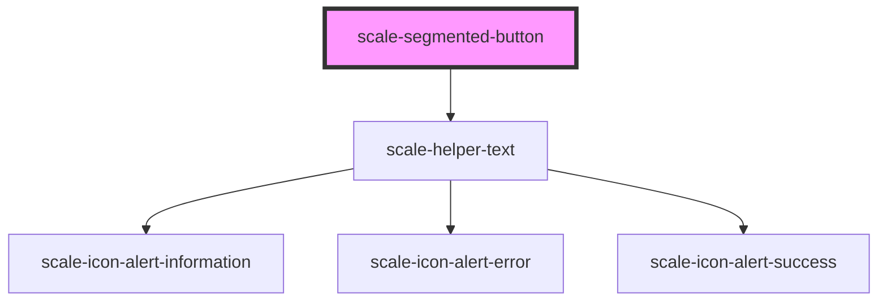

# scale-segmented-button-group

<!-- Auto Generated Below -->

## Properties

| Property               | Attribute                | Description                                                  | Type                             | Default                                  |
| ---------------------- | ------------------------ | ------------------------------------------------------------ | -------------------------------- | ---------------------------------------- |
| `ariaLabelTranslation` | `aria-label-translation` | (optional) aria-label attribute needed for icon-only buttons | `string`                         | ``segment button with $slottedSegments`` |
| `disabled`             | `disabled`               | (optional) If `true`, the button is disabled                 | `boolean`                        | `false`                                  |
| `fullWidth`            | `full-width`             | (optional) If `true`, expand to container width              | `boolean`                        | `false`                                  |
| `helperText`           | `helper-text`            | (optional) If `true`, show error message                     | `string`                         | `'Please select an option'`              |
| `invalid`              | `invalid`                | (optional) If `true`, show error message                     | `boolean`                        | `false`                                  |
| `label`                | `label`                  | (optional) Button label                                      | `string`                         | `undefined`                              |
| `longestButtonWidth`   | `longest-button-width`   |                                                              | `string`                         | `undefined`                              |
| `multiSelect`          | `multi-select`           | (optional) Allow more than one button to be selected         | `boolean`                        | `false`                                  |
| `size`                 | `size`                   | (optional) The size of the button                            | `"large" \| "medium" \| "small"` | `'small'`                                |
| `styles`               | `styles`                 | (optional) Injected CSS styles                               | `string`                         | `undefined`                              |

## Events

| Event          | Description                                                                                        | Type               |
| -------------- | -------------------------------------------------------------------------------------------------- | ------------------ |
| `scale-change` | Emitted when button is clicked                                                                     | `CustomEvent<any>` |
| `scaleChange`  | **[DEPRECATED]** in v3 in favor of kebab-case event names   | `CustomEvent<any>` |

## Dependencies

### Depends on

- [scale-helper-text](../helper-text)

### Graph

----------------------------------------------

*Built with [StencilJS](https://stenciljs.com/)*
