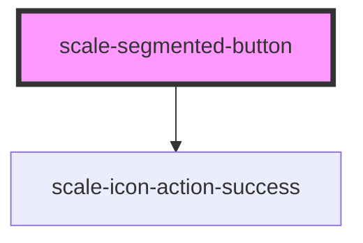

# scale-segmented-button

<!-- Auto Generated Below -->

## Properties

| Property                     | Attribute                      | Description                                                                                                                                            | Type                               | Default        |
| ---------------------------- | ------------------------------ | ------------------------------------------------------------------------------------------------------------------------------------------------------ | ---------------------------------- | -------------- |
| `adjacentSiblings`           | `adjacent-siblings`            |                                                                                                                                                        | `"left" \| "leftright" \| "right"` | `undefined`    |
| `ariaDescriptionTranslation` | `aria-description-translation` | a11y text for getting meaningful value. `$buttonNumber` and `$selected` are template variables and will be replaces by their corresponding properties. | `string`                           | `'$selected'`  |
| `ariaLabelSegmentedButton`   | `aria-label-segmented-button`  | (optional) aria-label attribute needed for icon-only buttons                                                                                           | `string`                           | `undefined`    |
| `ariaLangDeselected`         | `aria-lang-deselected`         | (optional) translation of 'deselected                                                                                                                  | `string`                           | `'deselected'` |
| `ariaLangSelected`           | `aria-lang-selected`           | (optional) translation of 'selected                                                                                                                    | `string`                           | `'selected'`   |
| `disabled`                   | `disabled`                     | (optional) If `true`, the button is disabled                                                                                                           | `boolean`                          | `false`        |
| `hasIcon`                    | `has-icon`                     | (optional) position within group                                                                                                                       | `boolean`                          | `undefined`    |
| `iconOnly`                   | `icon-only`                    | (optional) position within group                                                                                                                       | `boolean`                          | `undefined`    |
| `position`                   | `position`                     | (optional) position within group                                                                                                                       | `number`                           | `undefined`    |
| `segmentedButtonId`          | `segmented-button-id`          | (optional) button's id                                                                                                                                 | `string`                           | `undefined`    |
| `selected`                   | `selected`                     | (optional) If `true`, the button is selected                                                                                                           | `boolean`                          | `false`        |
| `size`                       | `size`                         | (optional) The size of the button                                                                                                                      | `"large" \| "medium" \| "small"`   | `'small'`      |
| `styles`                     | `styles`                       | (optional) Injected CSS styles                                                                                                                         | `string`                           | `undefined`    |
| `textOnly`                   | `text-only`                    | (optional) position within group                                                                                                                       | `boolean`                          | `undefined`    |
| `width`                      | `width`                        | (optional) Button width set to ensure that all buttons have the same width                                                                             | `string`                           | `undefined`    |

## Events

| Event         | Description                                                                                        | Type                                              |
| ------------- | -------------------------------------------------------------------------------------------------- | ------------------------------------------------- |
| `scale-click` | Emitted when button is clicked                                                                     | `CustomEvent<{ id: string; selected: boolean; }>` |
| `scaleClick`  | **[DEPRECATED]** in v3 in favor of kebab-case event names   | `CustomEvent<{ id: string; selected: boolean; }>` |

## Methods

### `setFocus() => Promise<void>`

#### Returns

Type: `Promise<void>`

## Dependencies

### Depends on

- [scale-icon-action-success](../icons/action-success)

### Graph

----------------------------------------------

*Built with [StencilJS](https://stenciljs.com/)*
