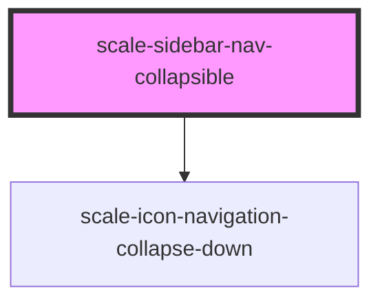

# scale-sidebar-nav-collapsible

We tried adding ::-moz-focus-inner for the button but JSS fails to parse that selector.

- https://developer.mozilla.org/en-US/docs/Web/CSS/::-moz-focus-inner
- https://stackoverflow.com/a/199319

<!-- Auto Generated Below -->

## Properties

| Property       | Attribute       | Description                                                                 | Type      | Default     |
| -------------- | --------------- | --------------------------------------------------------------------------- | --------- | ----------- |
| `active`       | `active`        | Label and icon get the active color                                         | `boolean` | `false`     |
| `bold`         | `bold`          | Bold label and icon                                                         | `boolean` | `false`     |
| `condensed`    | `condensed`     | Used normally for third level items                                         | `boolean` | `false`     |
| `expanded`     | `expanded`      | Set this to `true` to expand                                                | `boolean` | `undefined` |
| `href`         | `href`          | The URL where the link should point to                                      | `string`  | `'#'`       |
| `label`        | `label`         | The text for the button                                                     | `string`  | `undefined` |
| `nestingLevel` | `nesting-level` | Nesting level within the <scale-sidebar-nav> parent, gets set automatically | `number`  | `undefined` |
| `styles`       | `styles`        | (optional) Extra styles                                                     | `string`  | `undefined` |
| `tag`          | `tag`           | The parent wrapper                                                          | `string`  | `'li'`      |

## Shadow Parts

| Part        | Description |
| ----------- | ----------- |
| `"icon"`    |             |
| `"list"`    |             |
| `"wrapper"` |             |

## Dependencies

### Depends on

- [scale-icon-navigation-collapse-down](../icons/navigation-collapse-down)

### Graph

----------------------------------------------

*Built with [StencilJS](https://stenciljs.com/)*
