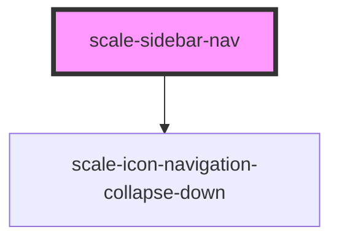

# scale-sidebar-nav

<!-- Auto Generated Below -->

## Properties

| Property                | Attribute                 | Description                                                                                                                                                                 | Type      | Default               |
| ----------------------- | ------------------------- | --------------------------------------------------------------------------------------------------------------------------------------------------------------------------- | --------- | --------------------- |
| `ariaLabelSidebarNav`   | `aria-label-sidebar-nav`  | From mdn: A brief description of the purpose of the navigation, omitting the term "navigation", as the screen reader will read both the role and the contents of the label. | `string`  | `undefined`           |
| `collapsible`           | `collapsible`             | Set to `true` to make the sidebar toggleable (useful for small screens)                                                                                                     | `boolean` | `false`               |
| `collapsibleLabel`      | `collapsible-label`       | Label for toggle button                                                                                                                                                     | `string`  | `'Menu'`              |
| `collapsibleMediaQuery` | `collapsible-media-query` | Automatically set `collapsible` based on this media query                                                                                                                   | `string`  | `'(max-width: 30em)'` |
| `styles`                | `styles`                  | (optional) Extra styles                                                                                                                                                     | `string`  | `undefined`           |

## Shadow Parts

| Part              | Description |
| ----------------- | ----------- |
| `"icon"`          |             |
| `"list"`          |             |
| `"toggle-button"` |             |

## Dependencies

### Depends on

- [scale-icon-navigation-collapse-down](../icons/navigation-collapse-down)

### Graph

----------------------------------------------

*Built with [StencilJS](https://stenciljs.com/)*
