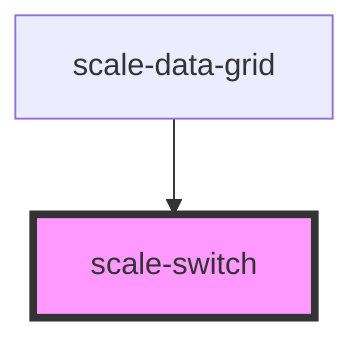

# scale-switch

<!-- Auto Generated Below -->

## Properties

| Property   | Attribute  | Description                | Type      | Default     |
| ---------- | ---------- | -------------------------- | --------- | ----------- |
| `checked`  | `checked`  | (optional) Active switch   | `boolean` | `false`     |
| `disabled` | `disabled` | (optional) Disabled switch | `boolean` | `false`     |
| `inputId`  | `input-id` | (optional) Input id        | `string`  | `undefined` |
| `label`    | `label`    | (optional) switch label    | `string`  | `undefined` |

## Events

| Event         | Description                         | Type               |
| ------------- | ----------------------------------- | ------------------ |
| `scaleChange` | Emitted when the switch was clicked | `CustomEvent<any>` |

## Dependencies

### Used by

 - [scale-data-grid](../data-grid)

### Graph

----------------------------------------------

*Built with [StencilJS](https://stenciljs.com/)*
