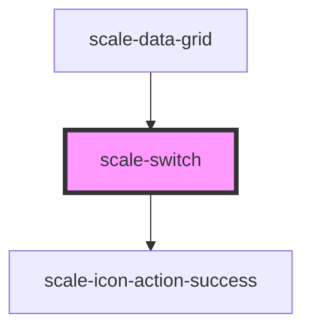

# scale-switch

<!-- Auto Generated Below -->

## Properties

| Property   | Attribute  | Description                    | Type      | Default     |
| ---------- | ---------- | ------------------------------ | --------- | ----------- |
| `checked`  | `checked`  | (optional) Active switch       | `boolean` | `false`     |
| `disabled` | `disabled` | (optional) Disabled switch     | `boolean` | `false`     |
| `inputId`  | `input-id` | (optional) Input id            | `string`  | `undefined` |
| `label`    | `label`    | (optional) switch label        | `string`  | `undefined` |
| `name`     | `name`     | (optional) Input name          | `string`  | `undefined` |
| `size`     | `size`     |                                | `string`  | `'large'`   |
| `styles`   | `styles`   | (optional) Injected CSS styles | `string`  | `undefined` |

## Events

| Event          | Description                                                                                        | Type               |
| -------------- | -------------------------------------------------------------------------------------------------- | ------------------ |
| `scale-change` | Emitted when the switch was clicked                                                                | `CustomEvent<any>` |
| `scaleChange`  | **[DEPRECATED]** in v3 in favor of kebab-case event names   | `CustomEvent<any>` |

## Dependencies

### Used by

 - [scale-data-grid](../data-grid)

### Depends on

- [scale-icon-action-success](../icons/action-success)

### Graph

----------------------------------------------

*Built with [StencilJS](https://stenciljs.com/)*
