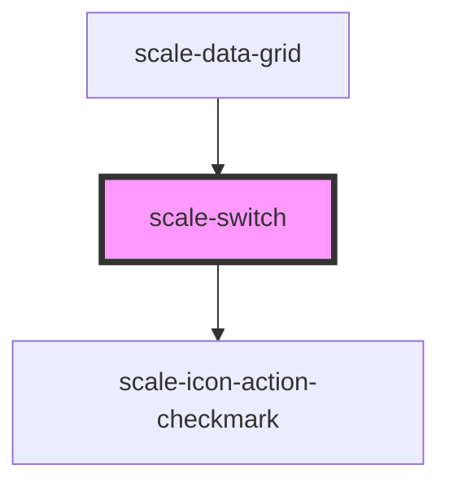

# scale-switch

<!-- Auto Generated Below -->

## Properties

| Property   | Attribute  | Description                                  | Type                 | Default     |
| ---------- | ---------- | -------------------------------------------- | -------------------- | ----------- |
| `checked`  | `checked`  | (optional) Active switch                     | `boolean`            | `false`     |
| `dataQa`   | `data-qa`  | (optional) data-qa attribute for e2e testing | `string`             | `undefined` |
| `disabled` | `disabled` | (optional) Disabled switch                   | `boolean`            | `false`     |
| `inputId`  | `input-id` | (optional) Input id                          | `string`             | `undefined` |
| `label`    | `label`    | (optional) switch label                      | `string`             | `undefined` |
| `name`     | `name`     | (optional) Input name                        | `string`             | `undefined` |
| `size`     | `size`     |                                              | `"large" \| "small"` | `'large'`   |
| `styles`   | `styles`   | (optional) Injected CSS styles               | `string`             | `undefined` |

## Events

| Event          | Description                         | Type               |
| -------------- | ----------------------------------- | ------------------ |
| `scale-change` | Emitted when the switch was clicked | `CustomEvent<any>` |

## Dependencies

### Used by

 - [scale-data-grid](../data-grid)

### Depends on

- [scale-icon-action-checkmark](../icons/action-checkmark)

### Graph

----------------------------------------------

*Built with [StencilJS](https://stenciljs.com/)*
