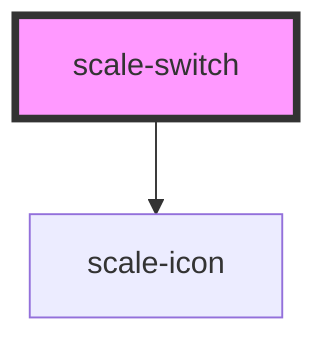

# scale-switch

<!-- Auto Generated Below -->

## Properties

| Property      | Attribute      | Description                        | Type                                     | Default     |
| ------------- | -------------- | ---------------------------------- | ---------------------------------------- | ----------- |
| `active`      | `active`       | (optional) Active switch           | `boolean`                                | `false`     |
| `customClass` | `custom-class` | (optional) Switch class            | `string`                                 | `''`        |
| `disabled`    | `disabled`     | (optional) Disabled switch         | `boolean`                                | `false`     |
| `iconOff`     | `icon-off`     | (optional) icon when switch is off | `string`                                 | `undefined` |
| `iconOn`      | `icon-on`      | (optional) icon when switch is on  | `string`                                 | `undefined` |
| `iconSize`    | `icon-size`    | (optional)  Icon size              | `number`                                 | `16`        |
| `offText`     | `off-text`     | (optional) list Icon size          | `string`                                 | `undefined` |
| `onText`      | `on-text`      | (optional) List item icon          | `string`                                 | `undefined` |
| `styles`      | --             | (optional) Injected jss styles     | `StyleSheet<string \| number \| symbol>` | `undefined` |

## Dependencies

### Depends on

- [scale-icon](../icon)

### Graph

----------------------------------------------

*Built with [StencilJS](https://stenciljs.com/)*
