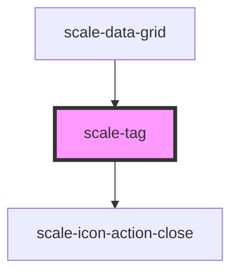

# scale-tag

<!-- Auto Generated Below -->

## Usage

### Tag

### Default

<scale-tag>
  Label
</scale-tag>

### Pill

<scale-tag pill>
  Label
</scale-tag>

### Link

<scale-tag href="http://example.com">
  Label
</scale-tag>

## Properties

| Property      | Attribute      | Description                    | Type                                                                                                                                       | Default      |
| ------------- | -------------- | ------------------------------ | ------------------------------------------------------------------------------------------------------------------------------------------ | ------------ |
| `color`       | `color`        | (optional) Tag color           | `"black" \| "brown" \| "cyan" \| "dismissable" \| "green" \| "olive" \| "orange" \| "red" \| "standard" \| "teal" \| "violet" \| "yellow"` | `'standard'` |
| `disabled`    | `disabled`     | (optional) Tag disabled        | `boolean`                                                                                                                                  | `false`      |
| `dismissText` | `dismiss-text` | (optional) Dismiss label       | `string`                                                                                                                                   | `'dismiss'`  |
| `dismissable` | `dismissable`  | (optional) Tag dismissable     | `boolean`                                                                                                                                  | `false`      |
| `href`        | `href`         | (optional) Tag href            | `string`                                                                                                                                   | `''`         |
| `size`        | `size`         | (optional) Tag size            | `"small"`                                                                                                                                  | `undefined`  |
| `styles`      | `styles`       | (optional) Injected CSS styles | `string`                                                                                                                                   | `undefined`  |
| `target`      | `target`       | (optional) Tag target          | `string`                                                                                                                                   | `'_self'`    |
| `type`        | `type`         | (optional) Tag type            | `"standard" \| "strong"`                                                                                                                   | `'standard'` |

## Events

| Event         | Description                                                                                        | Type                      |
| ------------- | -------------------------------------------------------------------------------------------------- | ------------------------- |
| `scale-close` | (optional) Close icon click event                                                                  | `CustomEvent<MouseEvent>` |
| `scaleClose`  | **[DEPRECATED]** in v3 in favor of kebab-case event names   | `CustomEvent<MouseEvent>` |

## Shadow Parts

| Part                   | Description |
| ---------------------- | ----------- |
| `"button-dismissable"` |             |
| `"icon-dismissable"`   |             |

## Dependencies

### Used by

 - [scale-data-grid](../data-grid)

### Depends on

- [scale-icon-action-close](../icons/action-close)

### Graph

----------------------------------------------

*Built with [StencilJS](https://stenciljs.com/)*
