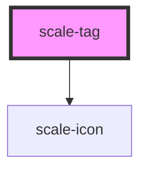

# scale-tag

<!-- Auto Generated Below -->

## Usage

### Tag

### Default

<scale-tag>
  Label
</scale-tag>

### Pill

<scale-tag pill>
  Label
</scale-tag>

### Link

<scale-tag href="http://example.com">
  Label
</scale-tag>

## Properties

| Property      | Attribute      | Description                    | Type                                     | Default     |
| ------------- | -------------- | ------------------------------ | ---------------------------------------- | ----------- |
| `customClass` | `custom-class` | (optional) Tag class           | `string`                                 | `''`        |
| `disabled`    | `disabled`     | (optional) Tag disabled        | `boolean`                                | `false`     |
| `dismissable` | `dismissable`  | (optional) Tag dismissable     | `boolean`                                | `false`     |
| `href`        | `href`         | (optional) Tag href            | `string`                                 | `''`        |
| `size`        | `size`         | (optional) Tag size            | `string`                                 | `''`        |
| `styles`      | --             | (optional) Injected jss styles | `StyleSheet<string \| number \| symbol>` | `undefined` |
| `target`      | `target`       | (optional) Tag target          | `string`                                 | `'_self'`   |
| `variant`     | `variant`      | (optional) Tag variant         | `string`                                 | `''`        |

## Events

| Event   | Description | Type               |
| ------- | ----------- | ------------------ |
| `close` |             | `CustomEvent<any>` |

## Dependencies

### Depends on

- [scale-icon](../icon)

### Graph

----------------------------------------------

*Built with [StencilJS](https://stenciljs.com/)*
