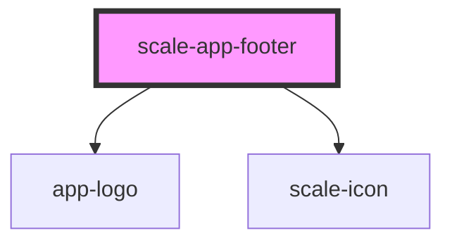

# scale-app-footer

<!-- Auto Generated Below -->

## Properties

| Property           | Attribute           | Description | Type     | Default                   |
| ------------------ | ------------------- | ----------- | -------- | ------------------------- |
| `claimLang`        | `claim-lang`        |             | `string` | `undefined`               |
| `copyright`        | `copyright`         |             | `string` | `'© Deutsche Telekom AG'` |
| `footerNavigation` | `footer-navigation` |             | `any`    | `[]`                      |
| `variant`          | `variant`           |             | `string` | `'standard'`              |

## Dependencies

### Depends on

- [app-logo](../app-logo)
- [scale-icon](../../icon)

### Graph

----------------------------------------------

*Built with [StencilJS](https://stenciljs.com/)*
