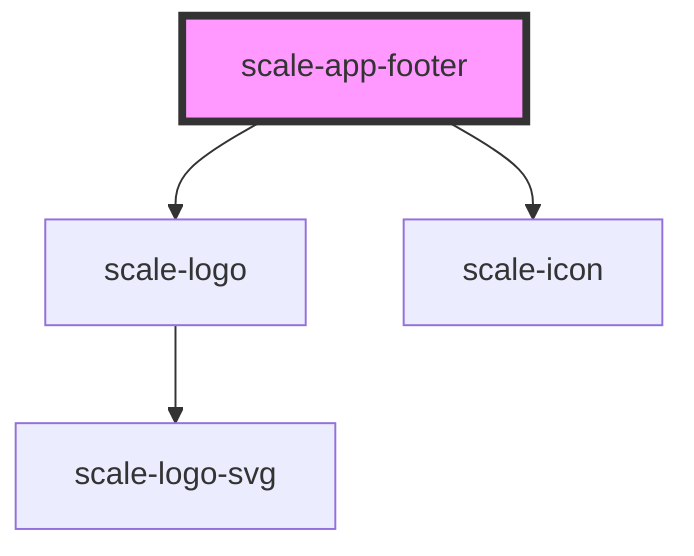

# scale-app-footer

<!-- Auto Generated Below -->

## Properties

| Property           | Attribute           | Description                    | Type     | Default                   |
| ------------------ | ------------------- | ------------------------------ | -------- | ------------------------- |
| `copyright`        | `copyright`         |                                | `string` | `'© Deutsche Telekom AG'` |
| `footerNavigation` | `footer-navigation` |                                | `any`    | `[]`                      |
| `styles`           | `styles`            | (optional) Injected CSS styles | `string` | `undefined`               |
| `variant`          | `variant`           |                                | `string` | `'standard'`              |

## Dependencies

### Depends on

- [scale-logo](../logo)
- [scale-icon](../../icon)

### Graph

----------------------------------------------

*Built with [StencilJS](https://stenciljs.com/)*
