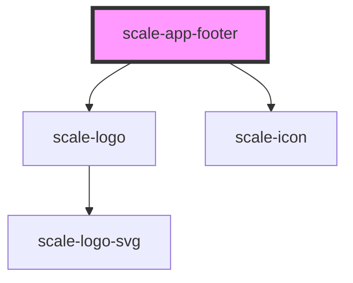

# scale-app-footer

<!-- Auto Generated Below -->

## Properties

| Property              | Attribute                | Description                    | Type                 | Default                   |
| --------------------- | ------------------------ | ------------------------------ | -------------------- | ------------------------- |
| `claimLang`           | `claim-lang`             |                                | `string`             | `undefined`               |
| `copyright`           | `copyright`              |                                | `string`             | `'© Deutsche Telekom AG'` |
| `footerNavigation`    | --                       |                                | `FooterNavigation[]` | `[]`                      |
| `logoAriaDescribedBy` | `logo-aria-described-by` |                                | `string`             | `undefined`               |
| `logoClick`           | `logo-click`             |                                | `any`                | `undefined`               |
| `logoHref`            | `logo-href`              |                                | `string`             | `undefined`               |
| `logoTitle`           | `logo-title`             |                                | `string`             | `undefined`               |
| `styles`              | `styles`                 | (optional) Injected CSS styles | `string`             | `undefined`               |
| `variant`             | `variant`                |                                | `string`             | `'standard'`              |

## Dependencies

### Depends on

- [scale-logo](../logo)
- [scale-icon](../../icon)

### Graph

----------------------------------------------

*Built with [StencilJS](https://stenciljs.com/)*
