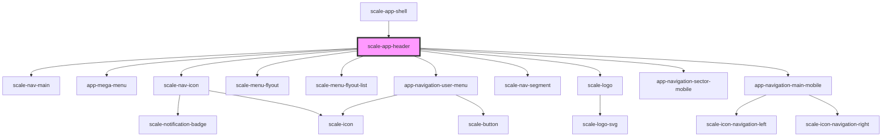

# scale-header

<!-- Auto Generated Below -->

## Properties

| Property              | Attribute                | Description | Type      | Default     |
| --------------------- | ------------------------ | ----------- | --------- | ----------- |
| `activeRouteId`       | `active-route-id`        |             | `string`  | `undefined` |
| `activeSectorId`      | `active-sector-id`       |             | `string`  | `undefined` |
| `addonNavigation`     | `addon-navigation`       |             | `any`     | `[]`        |
| `claimLang`           | `claim-lang`             |             | `string`  | `undefined` |
| `iconNavigation`      | `icon-navigation`        |             | `any`     | `[]`        |
| `isMegaMenuVisible`   | `is-mega-menu-visible`   |             | `boolean` | `false`     |
| `isMobileMenuVisible` | `is-mobile-menu-visible` |             | `boolean` | `false`     |
| `logoAriaDescribedBy` | `logo-aria-described-by` |             | `string`  | `undefined` |
| `logoClick`           | `logo-click`             |             | `any`     | `undefined` |
| `logoHideTitle`       | `logo-hide-title`        |             | `boolean` | `undefined` |
| `logoHref`            | `logo-href`              |             | `string`  | `undefined` |
| `logoTitle`           | `logo-title`             |             | `string`  | `undefined` |
| `mainNavigation`      | `main-navigation`        |             | `any`     | `[]`        |
| `megaMenuVisible`     | `mega-menu-visible`      |             | `boolean` | `false`     |
| `mobileMenuVisible`   | `mobile-menu-visible`    |             | `boolean` | `false`     |
| `portalName`          | `portal-name`            |             | `string`  | `''`        |
| `sectorNavigation`    | `sector-navigation`      |             | `any`     | `[]`        |
| `sticky`              | `sticky`                 |             | `boolean` | `false`     |
| `userNavigation`      | `user-navigation`        |             | `any`     | `[]`        |

## Dependencies

### Used by

 - [scale-app-shell](../app-shell)

### Depends on

- [scale-nav-main](../nav-main)
- [app-mega-menu](../app-mega-menu)
- [scale-nav-icon](../nav-icon)
- [scale-menu-flyout](../../menu-flyout)
- [scale-menu-flyout-list](../../menu-flyout-list)
- [app-navigation-user-menu](../app-navigation-user-menu)
- [scale-nav-segment](../nav-segment)
- [scale-logo](../logo)
- [app-navigation-sector-mobile](../app-navigation-sector-mobile)
- [app-navigation-main-mobile](../app-navigation-main-mobile)

### Graph

----------------------------------------------

*Built with [StencilJS](https://stenciljs.com/)*
