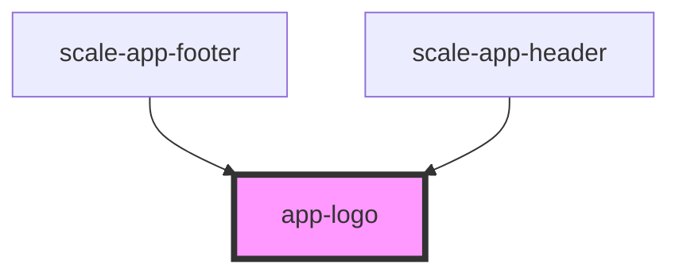

# app-logo

<!-- Auto Generated Below -->

## Properties

| Property    | Attribute    | Description | Type      | Default                 |
| ----------- | ------------ | ----------- | --------- | ----------------------- |
| `claim`     | `claim`      |             | `boolean` | `false`                 |
| `claimLang` | `claim-lang` |             | `string`  | `undefined`             |
| `color`     | `color`      |             | `string`  | `'#fff'`                |
| `href`      | `href`       |             | `string`  | `'javascript:void(0);'` |
| `logoTitle` | `logo-title` |             | `string`  | `'Telekom Logo'`        |

## Dependencies

### Used by

 - [scale-app-footer](../app-footer)
 - [scale-app-header](../app-header)

### Graph

----------------------------------------------

*Built with [StencilJS](https://stenciljs.com/)*
