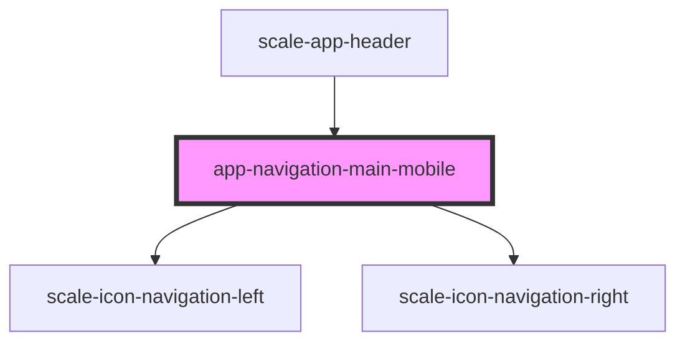

# app-navigation-main-mobile

<!-- Auto Generated Below -->

## Properties

| Property        | Attribute         | Description | Type         | Default     |
| --------------- | ----------------- | ----------- | ------------ | ----------- |
| `activeRouteId` | `active-route-id` |             | `string`     | `undefined` |
| `hide`          | `hide`            |             | `() => void` | `undefined` |
| `navigation`    | `navigation`      |             | `MenuItem[]` | `undefined` |

## Events

| Event       | Description | Type               |
| ----------- | ----------- | ------------------ |
| `closeMenu` |             | `CustomEvent<any>` |

## Dependencies

### Used by

 - [scale-app-header](../app-header)

### Depends on

- [scale-icon-navigation-left](../../icons/navigation-left)
- [scale-icon-navigation-right](../../icons/navigation-right)

### Graph

----------------------------------------------

*Built with [StencilJS](https://stenciljs.com/)*
