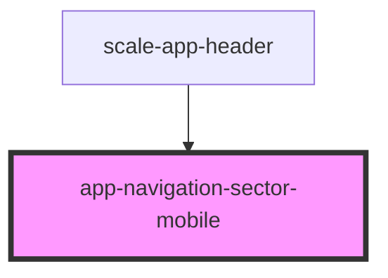

# app-navigation-sector-mobile

<!-- Auto Generated Below -->

## Properties

| Property         | Attribute          | Description | Type         | Default     |
| ---------------- | ------------------ | ----------- | ------------ | ----------- |
| `activeSectorId` | `active-sector-id` |             | `string`     | `undefined` |
| `hide`           | `hide`             |             | `() => void` | `undefined` |
| `navigation`     | `navigation`       |             | `MenuItem[]` | `undefined` |

## Dependencies

### Used by

 - [scale-app-header](../app-header)

### Graph

----------------------------------------------

*Built with [StencilJS](https://stenciljs.com/)*
