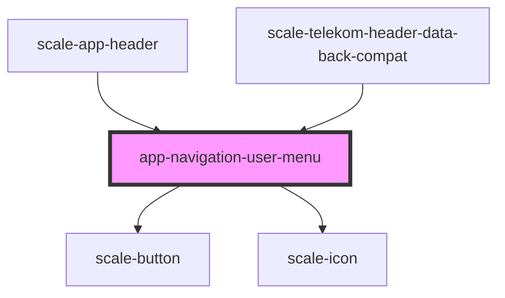

# app-navigation-user-menu

<!-- Auto Generated Below -->

## Properties

| Property     | Attribute    | Description | Type         | Default     |
| ------------ | ------------ | ----------- | ------------ | ----------- |
| `hide`       | --           |             | `() => void` | `undefined` |
| `navigation` | `navigation` |             | `any`        | `undefined` |

## Events

| Event       | Description | Type               |
| ----------- | ----------- | ------------------ |
| `closeMenu` |             | `CustomEvent<any>` |

## Shadow Parts

| Part                | Description |
| ------------------- | ----------- |
| `"rule-horizontal"` |             |

## Dependencies

### Used by

 - [scale-app-header](../app-header)
 - [scale-telekom-header-data-back-compat](../telekom-header-data-back-compat)

### Depends on

- [scale-button](../../button)
- [scale-icon](../../icon)

### Graph

----------------------------------------------

*Built with [StencilJS](https://stenciljs.com/)*
