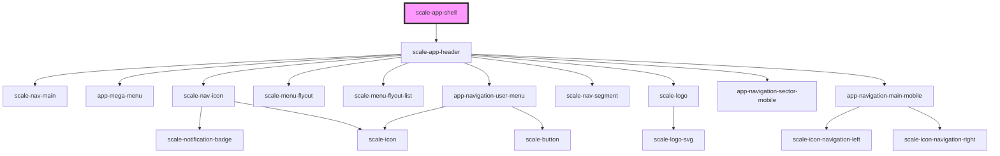

# scale-shell

<!-- Auto Generated Below -->

## Properties

| Property              | Attribute                | Description                    | Type      | Default     |
| --------------------- | ------------------------ | ------------------------------ | --------- | ----------- |
| `activeRouteId`       | `active-route-id`        |                                | `string`  | `''`        |
| `activeSectorId`      | `active-sector-id`       |                                | `string`  | `''`        |
| `addonNavigation`     | `addon-navigation`       |                                | `any`     | `[]`        |
| `claimLang`           | `claim-lang`             |                                | `string`  | `'de'`      |
| `iconNavigation`      | `icon-navigation`        |                                | `any`     | `[]`        |
| `logoAriaDescribedBy` | `logo-aria-described-by` |                                | `string`  | `undefined` |
| `logoClick`           | `logo-click`             |                                | `any`     | `undefined` |
| `logoHref`            | `logo-href`              |                                | `string`  | `undefined` |
| `logoTitle`           | `logo-title`             |                                | `string`  | `undefined` |
| `mainNavigation`      | `main-navigation`        |                                | `any`     | `[]`        |
| `portalName`          | `portal-name`            |                                | `string`  | `''`        |
| `sectorNavigation`    | `sector-navigation`      |                                | `any`     | `[]`        |
| `sticky`              | `sticky`                 |                                | `boolean` | `false`     |
| `styles`              | `styles`                 | (optional) Injected CSS styles | `string`  | `undefined` |
| `userNavigation`      | `user-navigation`        |                                | `any`     | `[]`        |

## Shadow Parts

| Part     | Description |
| -------- | ----------- |
| `"base"` |             |

## Dependencies

### Depends on

- [scale-app-header](../app-header)

### Graph

----------------------------------------------

*Built with [StencilJS](https://stenciljs.com/)*
