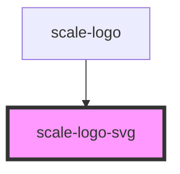

# scale-logo

<!-- Auto Generated Below -->

## Properties

| Property             | Attribute             | Description                                                                     | Type              | Default     |
| -------------------- | --------------------- | ------------------------------------------------------------------------------- | ----------------- | ----------- |
| `accessibilityTitle` | `accessibility-title` | (optional) When using the icon standalone, make it meaningful for accessibility | `string`          | `undefined` |
| `color`              | `color`               | (optional) Sets the icon color via the `fill` attribute                         | `string`          | `'magenta'` |
| `focusable`          | `focusable`           |                                                                                 | `boolean`         | `true`      |
| `innerRole`          | `inner-role`          |                                                                                 | `"img" \| "link"` | `'img'`     |
| `language`           | `language`            | (optional) The languages for the Text behind the Logo                           | `string`          | `'en'`      |
| `logoHideTitle`      | `logo-hide-title`     | (optional) Hide all logo related titles                                         | `boolean`         | `undefined` |
| `logoTitle`          | `logo-title`          | (optional) When using the icon standalone, make it meaningful for accessibility | `string`          | `undefined` |

## Shadow Parts

| Part         | Description |
| ------------ | ----------- |
| `"logo-svg"` |             |

## Dependencies

### Used by

 - [scale-logo](.)

### Graph

----------------------------------------------

*Built with [StencilJS](https://stenciljs.com/)*
