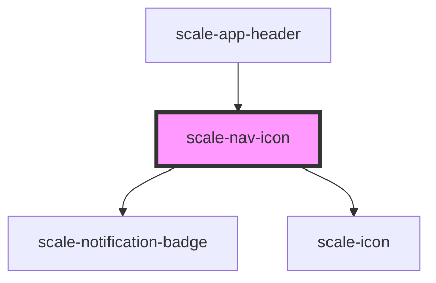

# scale-nav-icon

<!-- Auto Generated Below -->

## Properties

| Property                  | Attribute                     | Description                       | Type      | Default                 |
| ------------------------- | ----------------------------- | --------------------------------- | --------- | ----------------------- |
| `active`                  | `active`                      |                                   | `boolean` | `undefined`             |
| `badge`                   | `badge`                       |                                   | `boolean` | `false`                 |
| `badgeLabel`              | `badge-label`                 |                                   | `number`  | `undefined`             |
| `clickLink`               | `click-link`                  |                                   | `any`     | `undefined`             |
| `href`                    | `href`                        | (optional) href value             | `string`  | `'javascript:void(0);'` |
| `icon`                    | `icon`                        |                                   | `string`  | `undefined`             |
| `isActive`                | `is-active`                   | (optional) if this item is active | `boolean` | `undefined`             |
| `isMobileMenuOpen`        | `is-mobile-menu-open`         |                                   | `boolean` | `false`                 |
| `mobileMenuOpen`          | `mobile-menu-open`            |                                   | `boolean` | `false`                 |
| `refMobileMenuToggle`     | `ref-mobile-menu-toggle`      |                                   | `any`     | `undefined`             |
| `refMobileUserMenuToggle` | `ref-mobile-user-menu-toggle` |                                   | `any`     | `undefined`             |
| `refUserMenuToggle`       | `ref-user-menu-toggle`        |                                   | `any`     | `undefined`             |

## Dependencies

### Used by

 - [scale-app-header](../app-header)

### Depends on

- [scale-notification-badge](../../notification-badge)
- [scale-icon](../../icon)

### Graph

----------------------------------------------

*Built with [StencilJS](https://stenciljs.com/)*
