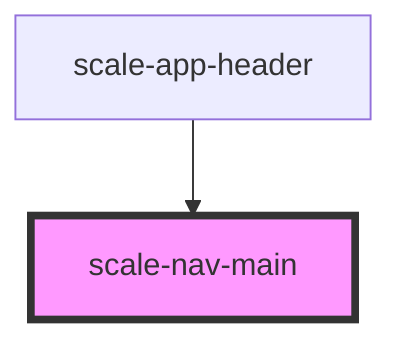

# scale-nav-main

<!-- Auto Generated Below -->

## Properties

| Property            | Attribute              | Description                             | Type      | Default                 |
| ------------------- | ---------------------- | --------------------------------------- | --------- | ----------------------- |
| `active`            | `active`               | (optional) if this item is active       | `boolean` | `undefined`             |
| `clickLink`         | `click-link`           |                                         | `any`     | `undefined`             |
| `href`              | `href`                 | (optional) href value                   | `string`  | `'javascript:void(0);'` |
| `innerId`           | `inner-id`             | (optional) inner element id             | `string`  | `undefined`             |
| `isActive`          | `is-active`            |                                         | `boolean` | `undefined`             |
| `isMegaMenuVisible` | `is-mega-menu-visible` |                                         | `boolean` | `false`                 |
| `megaMenuVisible`   | `mega-menu-visible`    | (optional) if this mega-menu is visible | `boolean` | `false`                 |
| `name`              | `name`                 | (optional) name value                   | `string`  | `undefined`             |
| `popup`             | `popup`                |                                         | `boolean` | `undefined`             |
| `target`            | `target`               | (optional) target value                 | `string`  | `'_self'`               |

## Dependencies

### Used by

 - [scale-app-header](../app-header)

### Graph

----------------------------------------------

*Built with [StencilJS](https://stenciljs.com/)*
