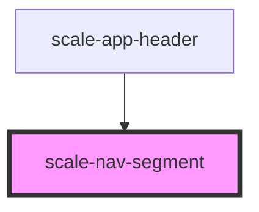

# scale-nav-segment

<!-- Auto Generated Below -->

## Properties

| Property   | Attribute   | Description                       | Type      | Default                 |
| ---------- | ----------- | --------------------------------- | --------- | ----------------------- |
| `active`   | `active`    |                                   | `boolean` | `undefined`             |
| `href`     | `href`      | (optional) href value             | `string`  | `'javascript:void(0);'` |
| `isActive` | `is-active` | (optional) if this item is active | `boolean` | `undefined`             |

## Dependencies

### Used by

 - [scale-app-header](../app-header)

### Graph

----------------------------------------------

*Built with [StencilJS](https://stenciljs.com/)*
