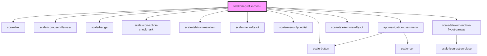

# profile-menu

<!-- Auto Generated Below -->

## Properties

| Property                      | Attribute                        | Description | Type      | Default     |
| ----------------------------- | -------------------------------- | ----------- | --------- | ----------- |
| `accessibilityLabel`          | `accessibility-label`            |             | `string`  | `undefined` |
| `appName`                     | `app-name`                       |             | `string`  | `undefined` |
| `closeMenuAccessibilityLabel` | `close-menu-accessibility-label` |             | `string`  | `undefined` |
| `hideLoginSettings`           | `hide-login-settings`            |             | `boolean` | `undefined` |
| `label`                       | `label`                          |             | `string`  | `undefined` |
| `loggedIn`                    | `logged-in`                      |             | `boolean` | `undefined` |
| `loginHelpLabel`              | `login-help-label`               |             | `string`  | `undefined` |
| `loginHelpUrl`                | `login-help-url`                 |             | `string`  | `undefined` |
| `loginLabel`                  | `login-label`                    |             | `string`  | `undefined` |
| `loginSettingsLabel`          | `login-settings-label`           |             | `string`  | `undefined` |
| `loginSettingsUrl`            | `login-settings-url`             |             | `string`  | `undefined` |
| `loginUrl`                    | `login-url`                      |             | `string`  | `undefined` |
| `logoutLabel`                 | `logout-label`                   |             | `string`  | `undefined` |
| `logoutUrl`                   | `logout-url`                     |             | `string`  | `undefined` |
| `noLoginYetLabel`             | `no-login-yet-label`             |             | `string`  | `undefined` |
| `registerLabel`               | `register-label`                 |             | `string`  | `undefined` |
| `registerUrl`                 | `register-url`                   |             | `string`  | `undefined` |
| `serviceLinks`                | `service-links`                  |             | `any`     | `undefined` |
| `serviceName`                 | `service-name`                   |             | `string`  | `undefined` |
| `shortDescr`                  | `short-descr`                    |             | `string`  | `undefined` |
| `userInfo`                    | `user-info`                      |             | `any`     | `undefined` |

## Dependencies

### Depends on

- [scale-button](../../button)
- [scale-link](../../link)
- [scale-icon-user-file-user](../../icons/user-file-user)
- [scale-badge](../../badge)
- [scale-icon-action-checkmark](../../icons/action-checkmark)
- [scale-telekom-nav-item](../telekom-nav-item)
- [scale-menu-flyout](../../menu-flyout)
- [scale-menu-flyout-list](../../menu-flyout-list)
- [app-navigation-user-menu](../app-navigation-user-menu)
- [scale-telekom-nav-flyout](../telekom-nav-flyout)
- [scale-telekom-mobile-flyout-canvas](../telekom-mobile-flyout-canvas)

### Graph

----------------------------------------------

*Built with [StencilJS](https://stenciljs.com/)*
