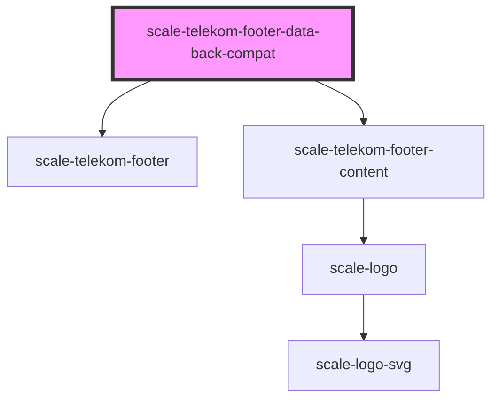

# scale-telekom-footer-data-back-compat

<!-- Auto Generated Below -->

## Properties

| Property           | Attribute           | Description | Type                      | Default                   |
| ------------------ | ------------------- | ----------- | ------------------------- | ------------------------- |
| `copyright`        | `copyright`         |             | `string`                  | `'© Deutsche Telekom AG'` |
| `footerNavigation` | `footer-navigation` |             | `any`                     | `[]`                      |
| `type`             | `type`              |             | `"minimal" \| "standard"` | `'standard'`              |

## Dependencies

### Depends on

- [scale-telekom-footer](../telekom-footer)
- [scale-telekom-footer-content](../telekom-footer)

### Graph

----------------------------------------------

*Built with [StencilJS](https://stenciljs.com/)*
