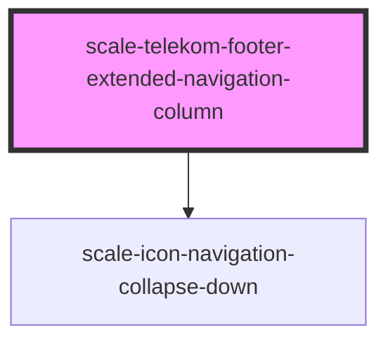

# scale-telekom-footer-extended-navigation-column

<!-- Auto Generated Below -->

## Properties

| Property       | Attribute       | Description             | Type      | Default     |
| -------------- | --------------- | ----------------------- | --------- | ----------- |
| `expanded`     | `expanded`      | Set to `true` to expand | `boolean` | `false`     |
| `heading`      | `heading`       |                         | `string`  | `undefined` |
| `headingLevel` | `heading-level` |                         | `string`  | `'2'`       |

## Shadow Parts

| Part                  | Description |
| --------------------- | ----------- |
| `"heading"`           |             |
| `"heading-button"`    |             |
| `"heading-container"` |             |

## Dependencies

### Depends on

- [scale-icon-navigation-collapse-down](../../icons/navigation-collapse-down)

### Graph

----------------------------------------------

*Built with [StencilJS](https://stenciljs.com/)*
